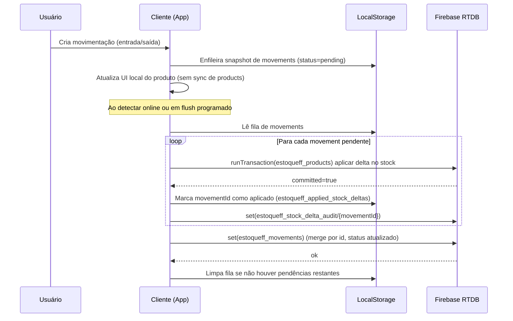

## Sincronização de estoque por delta (runTransaction)

### Objetivo
O estoque deixa de ser sincronizado por snapshot completo no nó `estoqueff_products` durante movimentações (entrada/saída). Em vez disso, o cliente aplica deltas incrementais (+/-) por movimentação pendente usando `runTransaction`, preservando atualizações concorrentes de outros usuários.

### Premissas
- Movimentações continuam sendo sincronizadas no nó `estoqueff_movements` (com merge por `id`).
- Estoque é atualizado via transação no nó `estoqueff_products` (campo `stock` do produto).
- Idempotência do delta (retries/reenvios) é garantida localmente por `localStorage` em `estoqueff_applied_stock_deltas`.
- Auditoria por movimentação é persistida em `estoqueff_stock_delta_audit/{movementId}`.

### Fluxo (alto nível)
1. Cliente registra movimentação localmente com `status: "pending"` (fila offline).
2. Na reconexão (ou tentativa online), o flush da fila de movimentações:
   - identifica movimentações pendentes (status `pending`/`syncing`);
   - para cada pendência, aplica `delta = +quantity` (entrada) ou `delta = -quantity` (saída) usando `runTransaction` em `estoqueff_products`;
   - grava auditoria por movimentação em `estoqueff_stock_delta_audit/{movementId}`;
   - faz merge e grava `estoqueff_movements`, marcando como `synced` apenas as movimentações cujo delta foi aplicado.
3. Se algum delta falhar, a fila é mantida e ocorre retry com backoff.

### Diagrama de sequência

### Observabilidade
- Logs no console podem ser habilitados com `localStorage.setItem("estoqueff_debug_sync","1")`.
- Auditoria persistida: `estoqueff_stock_delta_audit/{movementId}` com `delta`, `observedBefore`, `observedAfter`, `clientId` e timestamp.

### Critérios de sucesso
- Estoque não sofre sobrescrita regressiva por snapshots antigos após reconexão.
- Movimentações permanecem completas e consistentes após retries.
- Atualizações concorrentes de estoque são resolvidas via transação (sem perda de incrementos/decrementos).
- Em falhas parciais, a fila não é descartada e o sistema realiza retries até concluir.
